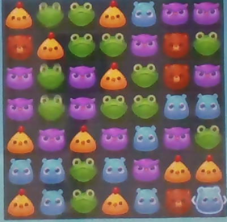
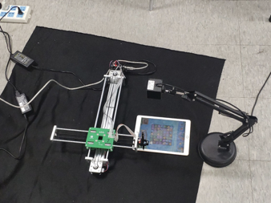

# KaiXinXiaoXiaoLe
Control an automatic machine with a capacitance pen to play the game : Kai Xin Xiao Xiao Le. We use UDP to connect the server and client, finally succeed to play the game well. Before use

- Please change the IP address in pyServer.py and userController.cpp
- Please put a black background under the IPad
- Please initially run pyServer.py without the machine in the image, then run the whole VS project with the machine initially at the left-up corner of the IPad for initial point.

We first get the animal matrix from the camera, the DQN agent will get us an action to move. The action is recalculated as pixel point and get back to the automatic machine.

Our explanation on all parts of the project and our game video is avaliable on [Jbox](https://jbox.sjtu.edu.cn/l/Ou6HUp). The last page of the PPT is our video.